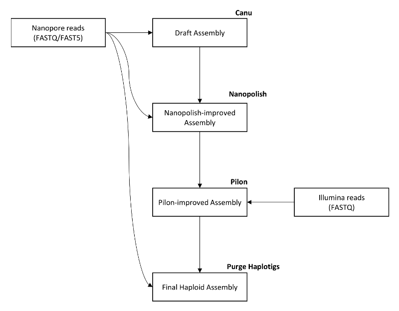
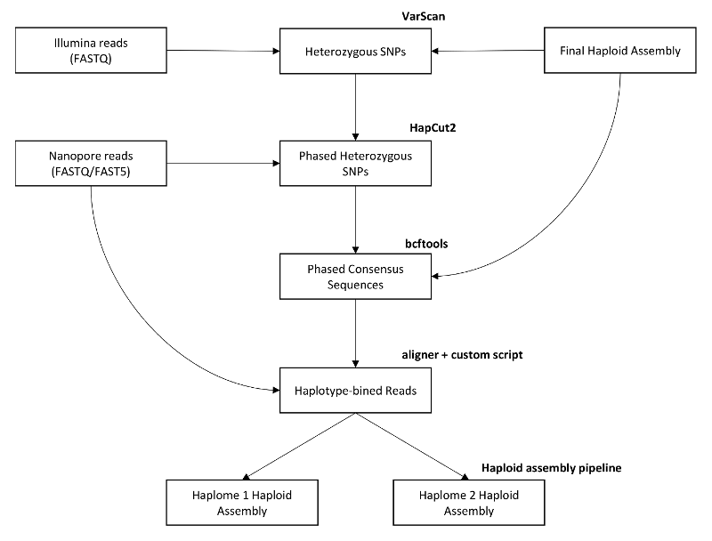

Custom scripts, annotations, and workflows for publication: _"New genome assemblies reveal patterns of domestication and adaptation across Brettanomyces (Dekkera) species."_

## Contents
- _annotations/_ - Genome annotation files generated for _Brettanomyces_ species
- _scripts/_ - Custom scripts and snakemake pipeline files used
- _Workflows.pdf_ - Command lines and descriptions for performing analyses

## Assembly pipeline

Detailed workflows for the assemblies are available in .

The haploid assembly pipeline consisted of assembly of Oxford Nanopore MinION long-reads with Canu, followed by polishing with nanopolish using the signal-level raw FAST5 files, polishing with Pilon using Illumina short reads (both paried end and mate-pair libraries), and finally cleaning with Purge Haploitgs.

A diploid assembly for the heterozygous diploid strain _B. anomalus_ was generated from the haploid assembly of this strain. Illumina short reads were mapped and heterozygous SNPs were called. These SNPs were then phased using the Nanopore longreads and new consensus sequences were generated and concatenated to represent both haplotypes (according to high-confidence SNPs only). These sequences were used to bin the Nanopore longreads into their individual haplotypes by mapping reads to the new concatenated consensus sequences, and splitting the reads according to their mapping targets. The haplotype-binned long reads were then separately subject to the haploid assembly pipeline to generate a diploid assembly when combined.

